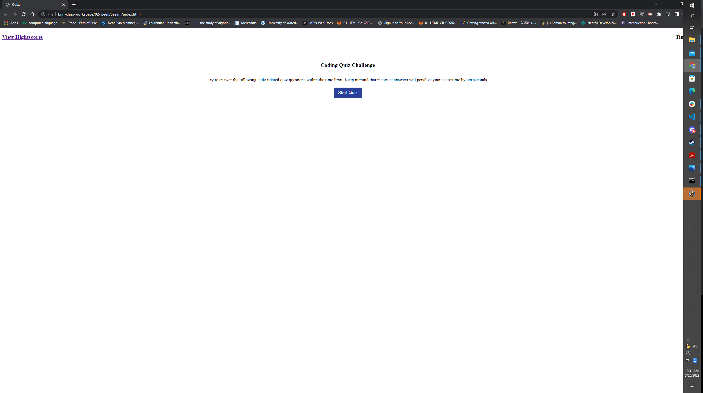
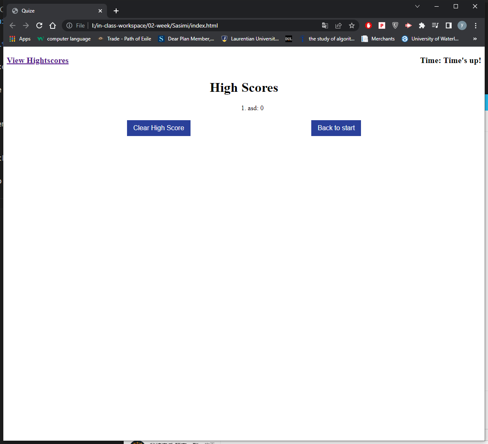
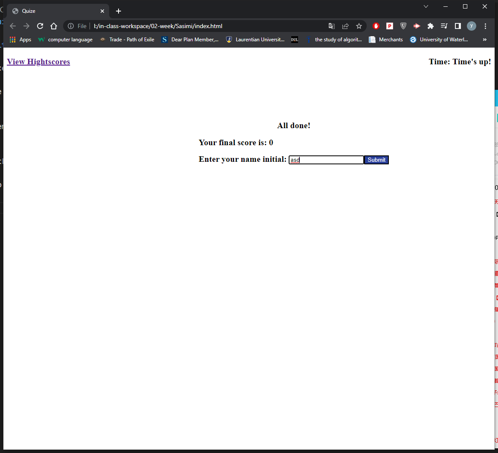
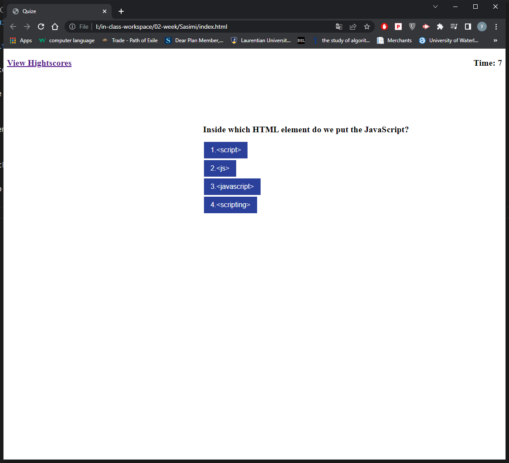

# 04 Web APIs: Code Quiz

## Create a quiz website which contains some code questions

According to acceptance Criteria, I create a similer website which for users take a code quiz.

Web API is good to use and can achieve many functions.
For example:
    setAttribute
    document.createElement
    addEventListener

I really like addEventListener, it is easy to use.

setInterval is used to do time count down for the page.

https://midnightwxd.github.io/Sasimi/
